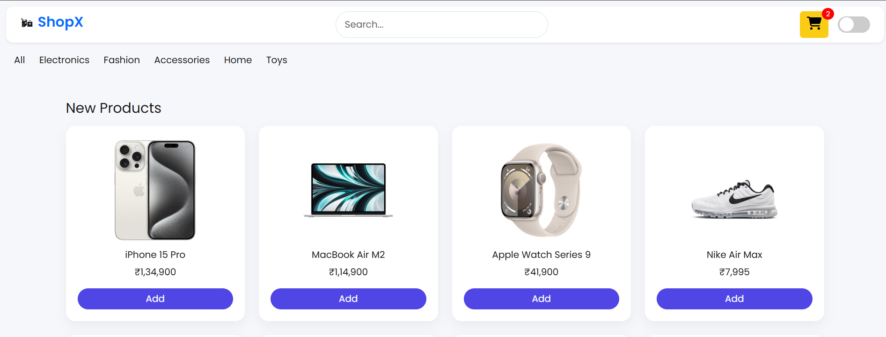
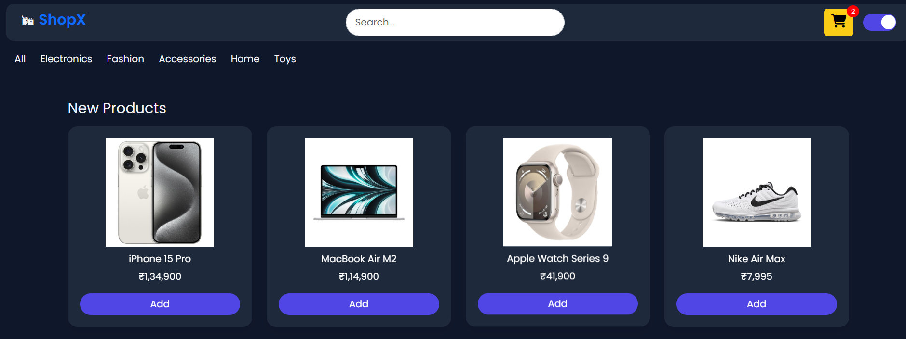

<h1 align="center">🛒 ShopX</h1>

<p align="center">
  <b>Modern E-commerce Web App with a Fully Functional Cart System</b><br/>
  Built using HTML, CSS & JavaScript
</p>

<p align="center">
  🚀 <a href="https://drash011.github.io/ShopX/">Live Demo</a>
  &nbsp;&nbsp;&nbsp;&nbsp;
  🔗 <a href="https://www.linkedin.com/in/drashti-thummar-07b847389">LinkedIn</a>
</p>

---

## ✨ Overview

ShopX is a responsive e-commerce frontend where users can browse products, search, filter categories, and manage a **real-time shopping cart**.

---

## 📸 Preview

<p align="center">
  
</p>

<br/>

<p align="center">
  
</p>

<br/>

---

## ⚡ Features

<div align="center">

| Feature | Description |
|--------|------------|
| 🛍️ Cart System | Add & remove items easily |
| 🔄 Live Updates | Instant total price calculation |
| 🔍 Search | Find products quickly |
| 🧭 Categories | Filter by sections |
| 🌗 Theme Toggle | Light & Dark mode |
| 📱 Responsive | Works on all devices |

</div>

---

## 🛠️ Tech Stack

<p align="center">
  HTML • CSS • JavaScript
</p>

---

## 📂 Project Structure

```
ShopX/
├── index.html
├── style.css
├── script.js
├── images/
│   ├── product1.png
│   ├── product2.png
│   └── ...
└── Images/
    ├── light.png
    └── dark.png
```

---


---

## 🚧 Future Improvements

- Checkout system  
- Wishlist feature  
- Authentication  
- Backend integration  

---

## 📬 Connect

LinkedIn: https://linkedin.com/in/your-profile  

---

<p align="center">
  Keep building. Keep growing. 🚀
</p>
